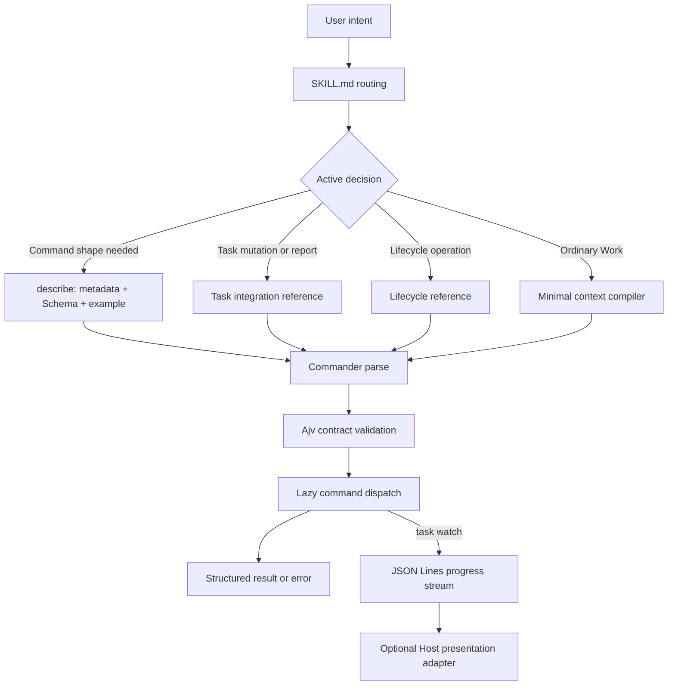

# CLI Contracts and Task Progress

Load this reference only when command discovery, JSON input validation,
real-time Task status, or a Host presentation adapter is active.

## Generated parameter overview

Commander owns command and option parsing. Ajv validates registered JSON Schema
contracts. Do not inspect source merely to learn a command shape; query the
generated description derived from command metadata, JSON Schema, and examples:

```bash
node scripts/zipzap.mjs describe
node scripts/zipzap.mjs describe invoke --operation execute
node scripts/zipzap.mjs describe initialize --action configure
node scripts/task.mjs describe
node scripts/task.mjs describe watch
```

Do not maintain a second handwritten field table. Update command metadata,
Schema, and representative examples, then let `describe` project the overview.

## Invocation flow



Help, examples, descriptions, `source-resolve`, and `document-route` do not load
the complete ZipZap catalog. Commands load the smallest authoritative data set
their execution needs. Reused module source files are parsed once per catalog
load.

## Progress protocol

`task watch` emits `schemas/task-progress.schema.json`. Consumers should use
`task_id`, `revision`, `status`, `stage`, `blockers`, `updated_at`, and `change`
as render inputs. `sequence` orders events within one watch process; it is not a
durable Task revision. A terminal Task ends the stream. `SIGINT` ends a running
watch without mutating Task state.

The protocol is Host-consumable, but composer placement is Host-owned. Unless a
Host documents a custom component extension point, report the fallback as a
stream, terminal panel, or ordinary progress commentary rather than claiming a
Skill can inject UI above the input box.
